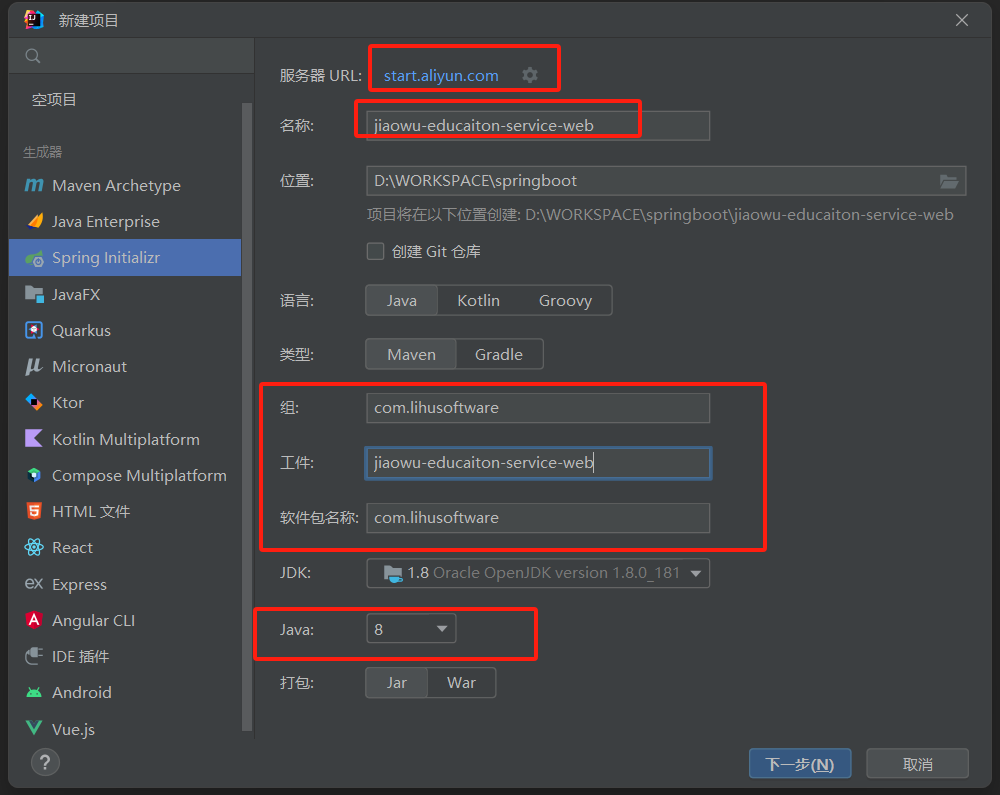
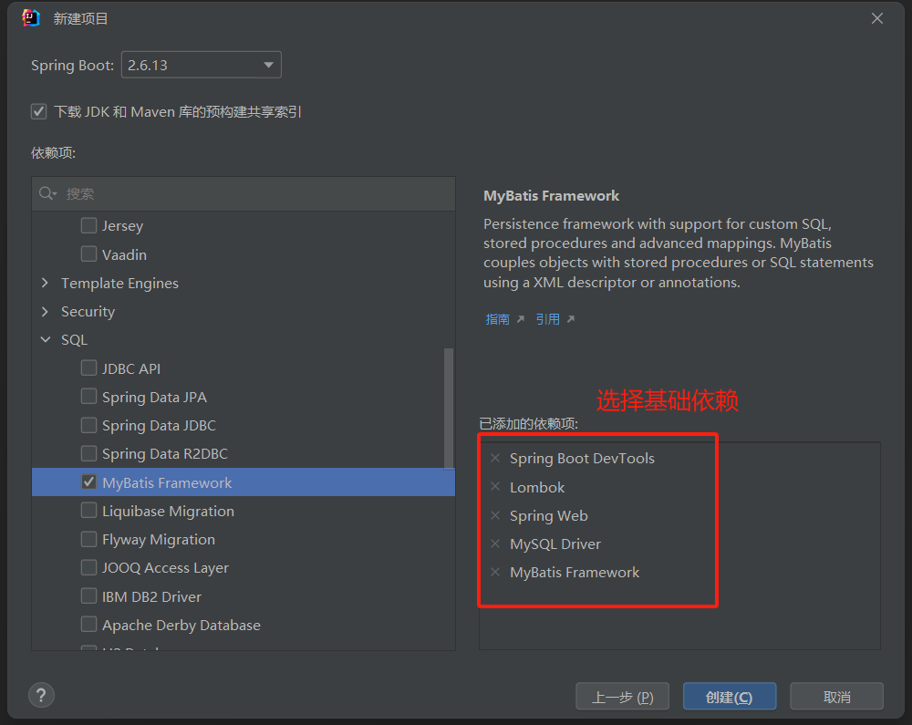
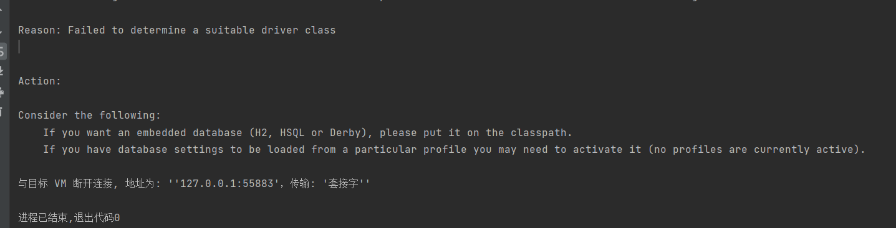

#### 项目准备
 > - 1) 开发工具 IDEA
 > - 2) JDK采用JAVA8
 > - 3) Mysql5.7或者8版本的数据库

#### 1、使用IDEA项目创建项目
 > - 1）新建一个springboot项目
 > - 2）选择服务器地址为 https://start.aliyun.com/
 > - 3）JDK版本为 8
 > - 4）勾选必要的依赖



#### 2、测试项目
##### 会发现报如下图的错误

##### 主要的原因是因为没有添加数据库~ ， 在application.properties中添加如下配置，重新启动项目
``` 
spring.datasource.driver-class-name=com.mysql.cj.jdbc.Driver
spring.datasource.url=jdbc:mysql://127.0.0.1:3306/springboot_demo?characterEncoding=UTF8&autoReconnect=true&serverTimezone=Asia/Shanghai&allowMultiQueries=true
spring.datasource.username=root
spring.datasource.password=123456
```
##### 配置好数据库后，重新启动项目，发现能够正常启动项目，测试数据库
- 1）加上@MapperScan("com.lihusoftware.mapper")扫描注解
- 2）xml文件目录classpath:mappers/*xml
- 3）集成mybatis-generate插件，自动生成实体类
```
<plugin>
    <groupId>org.mybatis.generator</groupId>
    <artifactId>mybatis-generator-maven-plugin</artifactId>
    <version>1.4.0</version>
    <configuration>
        <configurationFile>src/main/resources/generator/generator-config.xml</configurationFile>
        <overwrite>true</overwrite>
        <verbose>true</verbose>
    </configuration>
    <dependencies>
        <dependency>
            <groupId>mysql</groupId>
            <artifactId>mysql-connector-java</artifactId>
            <version>8.0.25</version>
        </dependency>
    </dependencies>
</plugin>
```
- 4）编写generate-config.xml文件
``` 
<?xml version="1.0" encoding="UTF-8"?>
    <!DOCTYPE generatorConfiguration
            PUBLIC "-//mybatis.org//DTD MyBatis Generator Configuration 1.0//EN"
            "http://mybatis.org/dtd/mybatis-generator-config_1_0.dtd">

    <generatorConfiguration>
        <context id="Mysql" targetRuntime="MyBatis3" defaultModelType="flat">

            <!-- 自动检查关键字，为关键字增加反引号 -->
            <property name="autoDelimitKeywords" value="true"/>
            <property name="beginningDelimiter" value="`"/>
            <property name="endingDelimiter" value="`"/>

            <!--覆盖生成XML文件-->
            <plugin type="org.mybatis.generator.plugins.UnmergeableXmlMappersPlugin" />
            <!-- 生成的实体类添加toString()方法 -->
            <plugin type="org.mybatis.generator.plugins.ToStringPlugin"/>

            <!-- 不生成注释 -->
            <commentGenerator>
                <property name="suppressAllComments" value="true"/>
            </commentGenerator>

            <jdbcConnection driverClass="com.mysql.cj.jdbc.Driver"
                            connectionURL="jdbc:mysql://127.0.0.1:3306/springboot_demo?serverTimezone=Asia/Shanghai"
                            userId="root"
                            password="123456">
            </jdbcConnection>

            <!-- domain类的位置 -->
            <javaModelGenerator targetProject="src\main\java"
                                targetPackage="com.lihusoftware.entity"/>

            <!-- mapper xml的位置 -->
            <sqlMapGenerator targetProject="src\main\resources"
                            targetPackage="mappers"/>

            <!-- mapper类的位置 -->
            <javaClientGenerator targetProject="src\main\java"
                                targetPackage="com.lihusoftware.mapper"
                                type="XMLMAPPER"/>

            <table tableName="tb_user"/>
        </context>
</generatorConfiguration>
```
- 5）添加日志记录输出配置
```
    # 日志记录输出配置
    logging.level.com.lihusoftware.mapper=trace
```